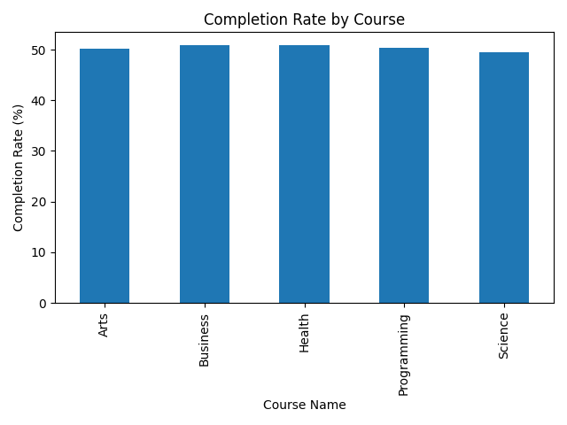

# Learner Engagement Analyzer (Python)

A Python-based tool for analyzing learner engagement in online courses.  
Processes discussion forum data, quiz performance, and activity logs to identify engagement patterns, predict drop-off risk, and generate actionable insights for instructional design improvements.

---

## What it does

- Analyze learner activity data from .csv files.
- Generate visualizations for completion rates, activity trends, and quiz performance.
- Identify engagement gaps and patterns.
- Support instructional design decisions with data-driven insights.

---

## Project Structure

learner-engagement-analyzer/
│
├── README.md                 # Project documentation
├── analyze.py                # Main analysis script
├── engagement_data.csv       # Sample dataset
├── completion_by_course.png  # Visualization example
├── .gitignore                # Ignored files
└── .venv/                    # Virtual environment (not tracked)

---

## Tools & Libraries
- **Python 3**
- **pandas** – data analysis and cleaning
- **matplotlib** – data visualization

---

## How it works

1. Load Data — Reads learner engagement metrics from a .csv file.  
2. Process & Analyze — Calculates participation and quiz averages, detects inactive learners, generates per-course completion summaries.  
3. Visualize — Creates bar charts and other plots to help identify trends.

---

## How to run
1. Clone this repository or download the files.
2. Create a virtual environment and install dependencies:
   ```bash
   python3 -m venv .venv
   source .venv/bin/activate
   pip install pandas matplotlib numpy
   ```
3. Place your dataset in the project folder and update the filename in analyze.py if necessary.
4. Run the script:
   ```bash
   python analyze.py
    ```
5. View the results:
- Key metrics will print in the terminal
- A chart will be saved as completion_by_course.png
- The chart will also display on screen

---

## Example Output
Demo Dataset: [Predict Online Course Engagement Dataset](https://www.kaggle.com/datasets/rabieelkharoua/predict-online-course-engagement-dataset)  
Source: Kaggle

**Chart:**
Example visualization showing completion rates by course:  


Average Completion Rate: 50.34%
Most Popular Course: Business

Top 3 Most Engaged Courses:
1. Data Science 101
2. Intro to Python
3. Machine Learning Basics

Highest Drop-off Risk: Course ID 204

---

## Future Improvements

- Add predictive modeling for drop-off risk.
- Integrate dashboard view (e.g., Streamlit).
- Expand dataset to include multiple platforms.
- Export automated PDF reports.

---

## License

This project is licensed under the MIT License.  
See the LICENSE file for details.

---

## Contributing

Pull requests are welcome!  
For major changes, please open an issue first to discuss what you would like to change.

---

**Author:** Yin Wah Kreher  
**Tagline:** Where design meets deep learning.
